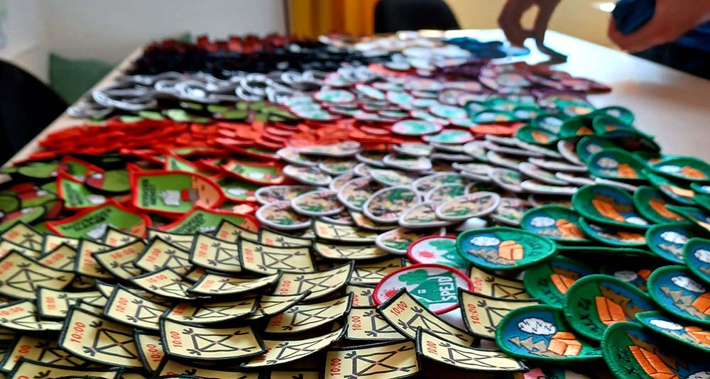

D. 27. februar 2021 er det nærmeste vi har haft på en rund fødselsdag for Mærkelex, men alligevel fik vi ikke markeret det. Hverken på Facebook, hjemmesiden, eller privat. Forhåbentlig ændrer det sig fremover.

I 2015 havde vi gået og snakket lidt om ideen bag Mærkelex, og i februar 2016 satte vi os ned en weekend for at bygge den første udgave af en oversigt over spejdermærker. Målet var at have et enkelt sted at sæge på alle mærker, og finde inspiration til møder og forløb. Både fra andre lederes uofficielle mærker, og fra mærkerne i de andre korps. Den første version blev bygget på under en uges arbejdstid, og det mest tidskrævende var at indsamle mærkebilleder og -beskrivelser af alle de mærker vi kunne finde.

Dengang var vi begge to relativt tidligt i vores karrierer som softwareudviklere. Niels var ansat i sit første fuldtidsjob efter en række studiejobs under bacheloruddannelsen. Anders arbejdede i et lille konsulentfirma med nogle kollegaer fra hans uddannelses praktiksted.

Nu har vi arbejdet med at bygge software i 5 år længere end vi havde dengang, og begge på mere eller mindre fuld tid. (Niels har også sneget en kandidatuddannelse og et barn ind.)

Allerede dengang i 2016 gik vi og drømte om at bygge mere software sammen, og snakkede meget om hvordan vi skulle bygge et firma op hvor det var fedt at være, og hvor vi kunne få lov til at bygge god software effektivt. Det var vigtigt for os at bygge noget der kom nogen til gode, noget vi ofte følte manglede i vores andre jobs.

Det førte til at Niels sideløbende med kandidatuddannelsen (og sammen med et par andre) begyndte at opbygge virksomheden [deranged](https://deranged.dk). I dag har vi arbejdet sammen i deranged ApS på fuld tid i to år, og vi får lavet en masse god software.

Samtidig har det bare også været helt vildt hårdt at få en virksomhed op at stå, og få stabiliseret den. Især 2020 var et hårdt år. Så hårdt at vi var flere der sagde "så hårdt skal det ikke være igen". Og coronapandemien kunne ikke tage skylden for det. Vi blev nødt til at tænke os godt om og tage nogle svære valg om hvordan vores virksomhed skulle se ud. Det kunne vi snakke længe om og i mange detaljer, men effekten var denne: helt ind i første del af 2021 var der rigtig meget pres på, og vi har simpelthen ikke haft overskud til så meget udover at drifte Mærkelex.

Nå ja, og så var på barsel i nogle måneder i sommeren 2021.

Men nu er vi så småt ved at være tilbage, og det står klart for os at det er vigtigt for os at have tid til at udvikle Mærkelex. Så det er værd lige at tage pulsen på hvor Mærkelex er henne, så vi kan beslutte hvad der skal ske nu.

Man kan desværre godt fornemme at Mærkelex ikke har fået den opmærksomhed derhar været behov for. For eksempel har vi ikke længere en komplet samling af hverken officielle eller uofficielle mærker. Der er simpelthen kommet nye mærker til på begge fronter, og vi har ikke fulgt ordentligt med. (Du kan hjælpe os ved at skrive til os om mærker vi mangler.)

Vi har solgt mærker på Mærkelex i omkring 4 år, og salget er steget støt. Men vi har stadig ingen indkøbskurv på siden. De fleste folk køber kun ét slags mærke ad gangen, og vi har arbejdet rundt om begrænsningen ved at lade folk bestille mærker via email i stedet. Men det virker som en fjollet og unødvendig begrænsning.

Hvis vi tager et lidt større perspektiv, bliver det også hurtigt tyseligt for os at kernen af Mærkelex er noget vi skrev for meget lang tid siden. Vi har finpudset og tilføjet funktionalitet og rettet til, men Mærkelex er en platform der er mærket af den erfaring vi havde da vi startede.

Det virker jo, det vi har bygget. Men vi har også tænkt en del om gerne at ville have en lidt mere stabil platform at arbejde med.

Vi kommer ikke til at lave alting om bare for at lave det om, men vi vil forsøge at optimere i forbindelse med at vi får bygget lidt til. En del af det vi vil bygge skal gøre det endnu nemmere at drive Mærkelex, men vi vil også gerne gøre det  for sælgere af mærker at sælge deres mærker.

Vi har også vildere ideer, men det gemmer vi til et fremtidigt skriv...

I mellemtiden vil vi bare gerne takke jer allesammen, der har brugt Mærkelex på den ene eller anden måde, fordi I har hjulpet os med at komme så langt som vi er kommet, og fordi I har været tålmodige med sidens skavanker.

Vi glæder os til flere eventyr med jer!

Spejderhilsen  
Niels og Anders fra Mærkelex
