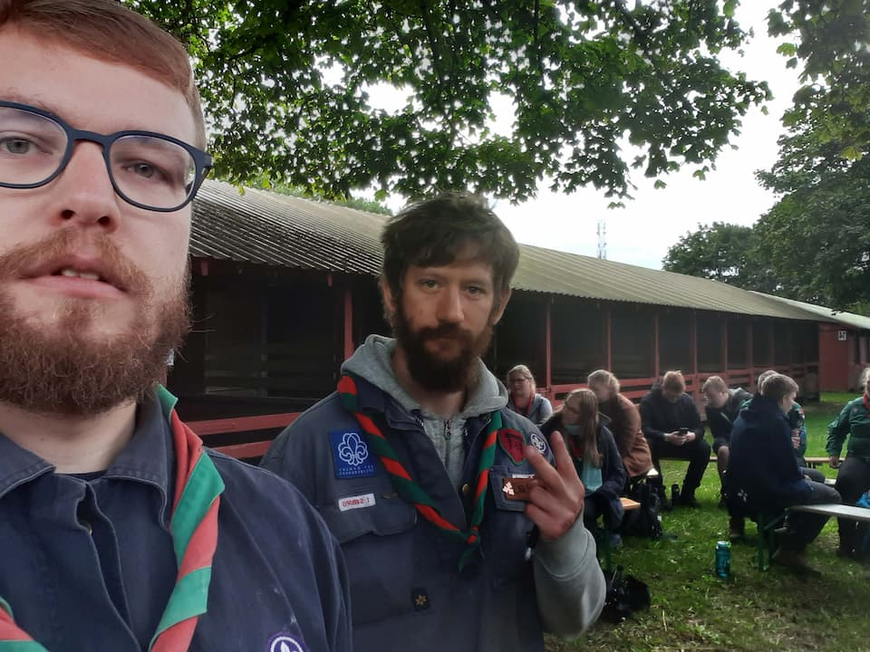
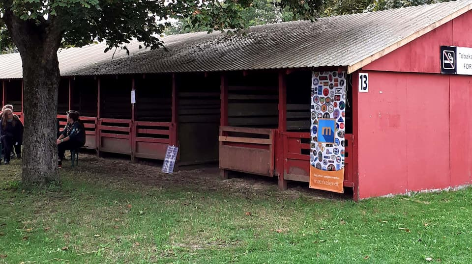
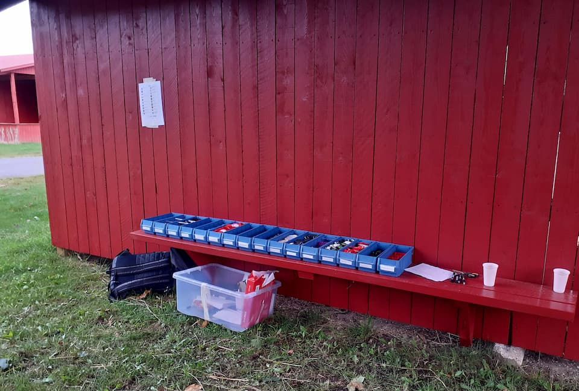
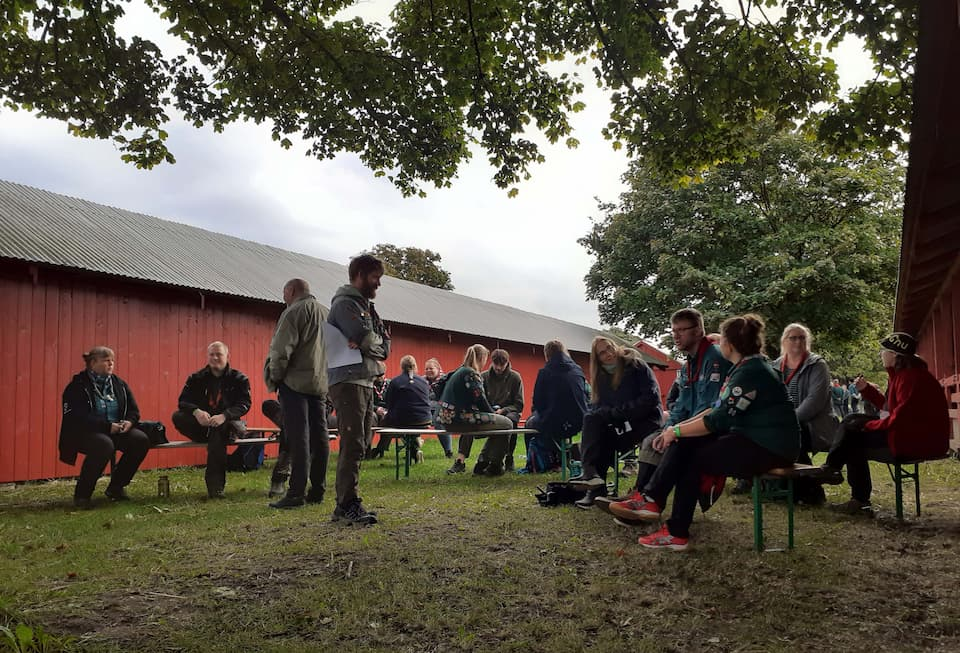

Når man er involveret i noget længe nok, kan man ikke undgå at få en ret god ide om det.

Mærkelex er ret centralt placeret i verdenen af spejder&shy;mærker. Især er vi tæt knyttet til fællesskabet omkring de uofficielle spejder&shy;mærker, som ledere og spejdere i Danmark selv finder på og deler med andre, til inspiration og motivation.

Det betyder at vi i løbet af de sidste par år har hørt om stort set alt der har rørt sig på den front -- og vi vil meget gerne dele vores historier med andre.
Vi har hørt en masse forskellige synspunkter på hvad et godt spejdermærke er, og hvordan man bør bruge spejder&shy;mærker i de forskellige korps.
Vi var med i debatten om (og hørte en masse forskellige vinkler på) kontroversen om Jesus-mærket.
Vi har lavet vores egne mærker, og bliver løbende kontaktet af spejdere og spejder&shy;ledere med ideer til nye mærker -- både nogen der er blevet til noget, og andre, der aldrig endte med at blive produceret.

Så da vi blev kontaktet af KFUM-spejdernes [Landstræf](https://www.landstræf.dk/) takkede vi hurtigt ja til at komme og holde en workshop.
Landstræf er KFUM-spejdernes årlige møde for spejder&shy;ledere, hvor der er tid til refleksion og debat om alt der rør sig i korpset.
Vi var inviteret til at snakke lidt om uofficielle spejder&shy;mærker, og inspirere ledere til at tænke over hvordan de bruger spejder&shy;mærker i deres gruppe, og hvad de synes er et godt mærke. Og måske endda inspirere nogen til at lave deres eget mærke.

Da vi en lørdag morgen ankom til Dyrskuepladsen i Roskilde, var vi først lidt bange for at stikke ud, som blå spejdere til et grønt arran&shy;gement. Men det tog ikke lang tid før vi så de første andre blå uniformer -- vi var åbentbart ikke de eneste fra Det Danske Spejderkorps til stede.

Da vi gik hen mod indtjekningsbordet blev vi overraskede over pludselig at se Hauke, en af vores gode spejdervenner, der er leder i KFUM Søborg -- ham havde vi ikke set siden vi var på spejderlejr sammen i 2019. Og så virkede hele det der Landstræf ikke længere så skræmmende.

Vi ankom til det sted, hvor vi skulle holde vores workshop, i skyggen af et træ, og satte op og gjorde klar. Vi havde også [alle de mærker vi sælger](/shop) med, og satte en lille tag-selv butik op, så folk fik muligheden for at købe mærker til deres gruppe, nu hvor vi alligevel var der.

På vores workshop fortalte vi først en del om Mærkelex, for det var ikke alle deltagere der vidste hvem vi var, eller hvad Mærkelex er for en størrelse.

Vi fortalte om [hvordan vi først fik ideen til siden](/hvem-er), om at vi efter lidt tid fik [etableret en webshop](/shop), og at vi i dag licenserer del mærker fra andre designere, så deres mærker overlever og stadig kan købes, selvom sælgerne ikke længere har lyst til at stå for salget.

Vi gav også et lille overblik over firmaets økonomi og hintede til vores planer for fremtiden (mere om det i en kommende blog post).

Og så gik vi i gang med at snakke mere om mærker.
Temaet for vores workshop var <em>Hvad er et godt mærke?</em> og vi så vores formål som at hjælpe deltagerne med at tænke over hvordan vi bruger spejder&shy;mærker i vores spejderhverdag.
Spejder&shy;mærker er en sjov størrelse, for små stykker stof vi syr på vores skjorter betyder helt vildt meget for os, fordi vi er spejdere.
Der er ofte diskussioner om hvad man kan være bekendt at lave som spejdermærke, og hvornår noget er i tråd med vores værdier som spejdere.

Rigtig mange af de uofficielle mærker er en måde at præsentere en samlet pakke for en aktivitet, hvor reglerne er klart sat op, og man endda får en belønning for at udføre den.
Men en del ledere synes også at der gerne skal være noget udfordrende eller læringsmæssigt til et mærke -- det er ikke alle aktiviteter der er et mærke værd.

Til sidst gav vi et overblik over hvordan man får produceret et mærke, sådan helt lavpraktisk, og hvilke ting man skal være opmærksom på.

I pauserne mellem workshops var der tid til en masse gode snakke med spejdere fra hele landet, inklusiv gensyn med de af vores KFUM-spejder-venner der var til stede på dagen.
Vi nød at høre alle de mange forskellige perspektiver på spejder&shy;mærker og om Mærkelex.
Generelt fik vi rigtig meget ros for siden, og det varmer sådan nogle gamle spejderhjerter som vores.

Alt i alt havde vi en rigtig god oplevelse, og håber at vi bliver inviteret til lignende arrangementer i fremtiden!
Hvis du er ved at planlægge et arrangement som vi måske ville kunne bidrage til, må du endelig [tage fat i os](/kontakt)!

Spejderhilsen  
Niels og Anders fra Mærkelex
